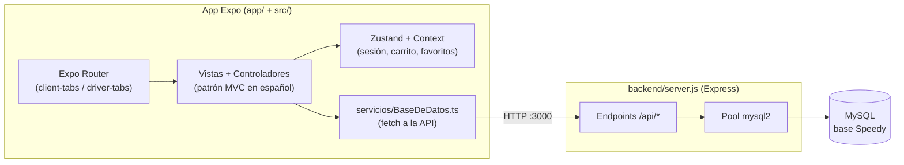

<div align="center">
  
  <h1>Speedy</h1>
  <p><b>App móvil de delivery de comida con vistas de cliente y de repartidor, hecha con React Native (Expo) y una API Express + MySQL.</b></p>
  
  
  
  
  
  
  
  
  <p>
    <a href="#-inicio-rápido">Inicio rápido</a> ·
    <a href="#-características">Características</a> ·
    <a href="#-arquitectura">Arquitectura</a> ·
    <a href="#-pruebas">Pruebas</a> ·
    <a href="#-lo-que-todavía-no-existe">Limitaciones</a>
  </p>
</div>

Speedy es un **prototipo** de app de delivery: el cliente explora restaurantes y productos, arma un carrito, crea pedidos y guarda favoritos, direcciones y métodos de pago; el repartidor tiene su propio conjunto de pantallas. Consta de una app Expo (Expo Router) y un backend Express + MySQL en `backend/`. **No es** una plataforma lista para producción: la autenticación es básica y parte del flujo del repartidor y del seguimiento es simulado (ver [limitaciones](#-lo-que-todavía-no-existe)).

## 🎬 Vista rápida

No se incluyen capturas: la app necesita un emulador o dispositivo y una base MySQL con datos sembrados. Flujo principal tal como está implementado:

```text
Login (usuario/correo + contraseña) ──► rol cliente ─────► Inicio · Explorar · Pedidos · Perfil
                                    └─► rol repartidor ──► Inicio · Ganancias · Perfil

Cliente:    Restaurante ─► Producto ─► Carrito ─► (cupón) ─► Crear pedido ─► Seguimiento (simulado)
Repartidor: Pedido ─► Aceptar ─► Entrega activa ─► Completar   (pantallas con datos de ejemplo)
```

## ✨ Características

| Característica | Detalle |
| --- | --- |
| Dos roles | Tras el login se abre `app/(client-tabs)` o `app/(driver-tabs)` según `usuarios.rol` (`cliente` / `repartidor`). |
| Catálogo | Categorías, restaurantes y productos (con detalle) leídos de la API (`/api/categorias`, `/api/restaurantes`, `/api/productos`). |
| Carrito | Estado en `ContextoCarrito` y pantalla de carrito; el pedido se envía a `POST /api/pedidos`. |
| Pedidos | El backend crea el pedido y su detalle dentro de una transacción MySQL y asigna un repartidor `disponible` si es delivery. Listado y detalle de pedidos. |
| Cupones | `POST /api/cupones/validar` reconoce tres códigos fijos escritos en el código (`WELCOME20`, `ENVIOFREE`, `SPEEDY5`); no lee la tabla `cupones`. |
| Favoritos, direcciones, métodos de pago, notificaciones | Endpoints propios en la API y pantallas correspondientes en `app/`. |
| Sesión persistente | Store de Zustand con `AsyncStorage` (`useAuthStore`). |
| Seguimiento con mapa | `react-native-maps` con una animación **simulada en el cliente** (temporizador de 20 s); no lee la posición real de un repartidor. |
| Ganancias del repartidor | Consulta pedidos `entregado` por repartidor a la API. |

## 🏗️ Arquitectura



<details>
<summary>Estructura de carpetas</summary>

```text
app/                Rutas de Expo Router: (client-tabs), (driver-tabs), carrito, producto, restaurante, seguimiento, perfil…
src/vistas/         Pantallas (subcarpetas cliente/ y repartidor/)
src/controladores/  Hooks con la lógica de cada pantalla
src/estilos/        Estilos por pantalla
src/context/        Carrito y favoritos (Context API)
src/stores/         useAuthStore (Zustand + AsyncStorage)
src/servicios/      BaseDeDatos.ts: cliente HTTP hacia la API
src/modelos/        Tipos TypeScript
backend/            server.js (API), migrate.js, migrations/*.sql, scripts de siembra y diagnóstico
database/           Esquema y datos iniciales alternativos
docs/               Documentación (estructura, comandos, esquema de BD, guía maestra)
```
</details>

## 🚀 Inicio rápido

| Requisito | Notas |
| --- | --- |
| Node.js | Sin `engines` declarado; Expo 54 requiere una versión LTS reciente |
| MySQL | Servidor local (p. ej. Laragon o XAMPP) |
| Expo Go o emulador | Para ejecutar en móvil |

1. Instala las dependencias de la app y del backend:
   ```bash
   npm install
   cd backend && npm install
   ```
2. Copia `backend/.env.example` a `backend/.env` y configúralo (`PORT`, `DB_HOST`, `DB_USER`, `DB_PASSWORD`, `DB_NAME`; la base por defecto se llama `Speedy`).
3. Crea el esquema y los datos de ejemplo (el script crea la base si no existe y aplica `backend/migrations/*.sql`):
   ```bash
   cd backend && node migrate.js
   ```
4. Arranca la API y luego la app:
   ```bash
   cd backend && npm start     # API en http://0.0.0.0:3000
   npx expo start              # desde la raíz; también npm run android | ios | web
   ```
5. En un dispositivo físico la app deduce la IP del servidor desde Expo; si aparece `Network request failed`, fija tu IP en `src/servicios/BaseDeDatos.ts` (ver `ARCHITECTURE.md`).

> No pude ejecutar estos pasos en esta revisión (requieren MySQL y un dispositivo); los comandos salen de `package.json`, `backend/package.json` y `backend/migrate.js`.

<details>
<summary>Variables de entorno (backend/.env)</summary>

| Variable | Uso | Valor por defecto en el código |
| --- | --- | --- |
| `PORT` | Puerto de la API | `3000` |
| `DB_HOST` | Host MySQL | `localhost` |
| `DB_USER` | Usuario MySQL | `root` |
| `DB_PASSWORD` | Contraseña MySQL | vacío |
| `DB_NAME` | Nombre de la base | `Speedy` |
| `JWT_SECRET` | Firma de los JWT | obligatorio si `NODE_ENV=production` (en desarrollo usa un valor de prueba) |
| `CORS_ORIGINS` | Orígenes web permitidos (separados por comas) | `http://localhost:8081,http://localhost:19006` |
</details>

## 🧪 Pruebas

El backend tiene tests con `node:test` (`cd backend && npm test`) para hash de contraseñas, JWT, middleware y las rutas de login/perfil con una base simulada. No hay tests de la app ni CI. Solo hay `npm run lint` (`expo lint`, ESLint con `eslint-config-expo`). Los scripts `backend/check_*.js` y `backend/seed_*.js` son utilidades de diagnóstico y siembra, no tests.

## 🔒 Seguridad

Estado real, **no apto para producción**:

- Contraseñas con bcrypt (las cuentas antiguas en texto plano se aceptan una vez y se re-guardan con hash al iniciar sesión). `POST /api/login` devuelve un JWT (HS256, 12 h) firmado con `JWT_SECRET` (obligatorio en producción). Con token y comprobación de propietario: perfil (`/api/usuarios/:id`, que ya no devuelve la contraseña) y métodos de pago (`/api/pagos`). **Sin proteger todavía:** pedidos, favoritos, direcciones, notificaciones y demás rutas.
- CORS limitado a los orígenes de `CORS_ORIGINS` (por defecto los de Expo web en localhost); las apps nativas no envían `Origin`.
- `backend/.env` y `CREDENCIALES.md` ya no se versionan (usa `backend/.env.example`; los usuarios de prueba los crean las migraciones/seeds). Como estuvieron en el historial de git, rota las credenciales de MySQL y las contraseñas de los usuarios de prueba que hayas usado.

## 🚧 Lo que todavía no existe

- Autorización por rol y token en el resto de rutas de la API (hoy solo perfil y métodos de pago).
- Seguimiento en tiempo real: mapa y estado se animan con un temporizador local; no hay WebSockets ni GPS del repartidor.
- Flujo de repartidor conectado: `PedidoAceptacionVista` usa datos de ejemplo y no llama a la API; no hay endpoint para cambiar el estado de un pedido.
- Cupones desde base de datos: **es una demo por diseño**. Hoy `POST /api/cupones/validar` acepta tres códigos fijos escritos en `server.js` (`WELCOME20`, `ENVIOFREE`, `SPEEDY5`) y no lee la tabla `cupones`.
- Pagos reales: los métodos de pago solo se guardan y listan.
- Pruebas automatizadas, CI y guía de despliegue.
- El README anterior era la plantilla de `create-expo-app` y no describía el proyecto.

## 📄 Licencia

[MIT](LICENSE).

<div align="center"><sub>Hecho por Luiss2080 · Speedy, prototipo de delivery con Expo y Express</sub></div>
